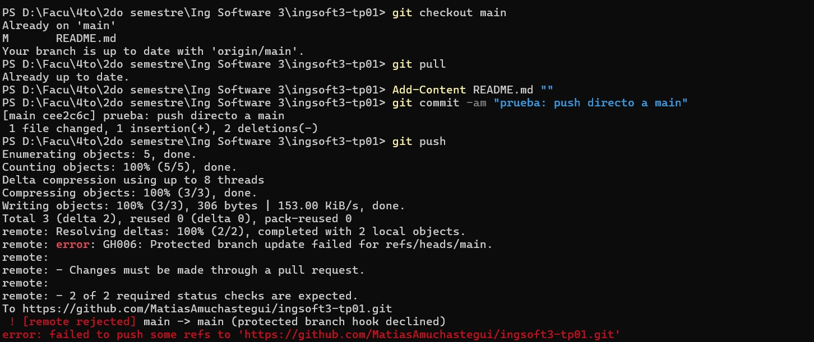
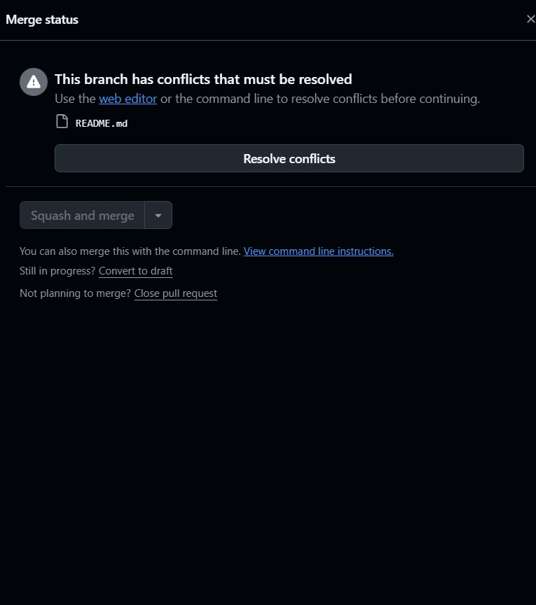
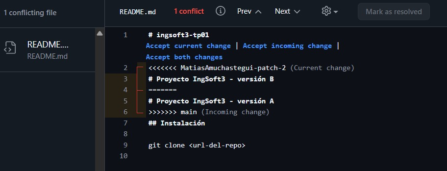
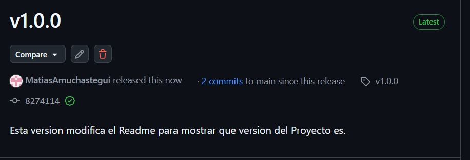

# Evidencias — TP1

## 1. Push directo a `main` rechazado

Intenté pushear un commit directo a `main` desde la consola y GitHub lo rechazó. En este caso puntual el mensaje que dio fue `[rejected] main -> main (fetch first)`, porque mi rama local estaba desactualizada respecto del remoto — no llegué a confirmar con un segundo intento (después de un `git pull`) que el rechazo también se produce por la regla de protección en sí. Lo dejo aclarado en `decisiones.md`.

## 2. El PR de la rama B no se puede mergear: conflicto

Al abrir el Pull Request de la rama B (que modificaba la misma línea del `README.md` que ya había entrado por la rama A), GitHub avisa "This branch has conflicts that must be resolved" y deshabilita el botón de mergear hasta resolverlos.

## 3. Los marcadores del conflicto

El editor de resolución de conflictos de GitHub muestra el `README.md` con los marcadores `<<<<<<<`, `=======` y `>>>>>>>`: arriba mi versión (rama B, "versión B"), abajo la que ya estaba en `main` (rama A, "versión A"). Tuve que elegir el contenido final y borrar los marcadores para poder mergear.

## 4. Release `v1.0.0` publicada

La release `v1.0.0`, marcada como *Latest*, publicada sobre el tag creado en `main`, con las notas de qué incluye esta versión.

---

# Evidencias — TP2

Todas las salidas de acá son reales y reproducibles. Cada bloque lleva el comando que lo generó,
y los dos scripts de verificación están en [`scripts/`](scripts/).

## 1. `docker compose up -d` desde cero

Con el volumen recién creado, es decir con la base vacía:

```console
$ docker compose up -d --build

 Network joyeria_publica Creating
 Network joyeria_publica Created
 Network joyeria_interna Creating
 Network joyeria_interna Created
 Volume joyeria_db-data Creating
 Volume joyeria_db-data Created
 Container joyeria-db-1 Creating
 Container joyeria-db-1 Created
 Container joyeria-backend-1 Creating
 Container joyeria-backend-1 Created
 Container joyeria-frontend-1 Creating
 Container joyeria-frontend-1 Created
 Container joyeria-db-1 Starting
 Container joyeria-db-1 Started
 Container joyeria-db-1 Waiting
 Container joyeria-db-1 Healthy
 Container joyeria-backend-1 Starting
 Container joyeria-backend-1 Started
 Container joyeria-backend-1 Waiting
 Container joyeria-backend-1 Healthy
 Container joyeria-frontend-1 Starting
 Container joyeria-frontend-1 Started
```

**Lo importante de esta salida son los `Waiting` / `Healthy`.** Es `depends_on` con
`condition: service_healthy` funcionando:

```
db Started -> Waiting -> Healthy -> backend Started -> Waiting -> Healthy -> frontend Started
```

Con un `depends_on` pelado la secuencia sería `db Started -> backend Started` de corrido, sin
ningún `Waiting`: Compose sólo ordenaría el arranque y el backend intentaría migrar contra una base
que todavía no acepta conexiones.

### Los tres servicios sanos

```console
$ docker compose ps

backend    Up 9 seconds (healthy)     8080/tcp
db         Up 15 seconds (healthy)    5432/tcp
frontend   Up 3 seconds (healthy)     0.0.0.0:8080->80/tcp, [::]:8080->80/tcp
```

Esta tabla es también la evidencia de **`EXPOSE` contra `ports:`**. Los tres contenedores declaran
su puerto interno, pero **sólo el frontend tiene un mapeo `0.0.0.0:8080->80`**. El `8080/tcp` del
backend y el `5432/tcp` de la base son `EXPOSE` sin publicar: documentan el puerto dentro de la red
de contenedores y nada más.

Comprobado desde el host, con los tres servicios corriendo y sanos:

```console
  puerto 8080 -> responde        (frontend, el único publicado)
  puerto 5080 -> NO responde     (backend)
  puerto 5432 -> NO responde     (base de datos)
```

## 2. El sistema funciona de punta a punta

```console
$ curl -s -o /dev/null -w "%{http_code}" http://localhost:8080/          -> 200
$ curl -s -o /dev/null -w "%{http_code}" http://localhost:8080/health    -> 200
$ curl -s -o /dev/null -w "%{http_code}" http://localhost:8080/stock     -> 200
```

`/stock` es una ruta de React Router: **no existe como archivo**. Que devuelva 200 con el HTML de
la aplicación es el `try_files $uri $uri/ /index.html` del `nginx.conf` haciendo su trabajo; sin
eso, recargar la página ahí daría un 404 de nginx.

El backend preparó la base solo al arrancar:

```console
$ docker compose logs backend

Aplicando migraciones pendientes.
Applying migration '20260812215041_InicialCreate'
Applying migration '20260814231653_TransferenciasEntreLocales'
Applying migration '20260814232512_SkuGeneradoPorElSistema'
Applying migration '20260814233510_QuitarPrecioMayorista'
Seed completo: 3 locales, 4 categorías, 6 productos, 4 usuarios. El administrador es admin@joyeria.local.
```

Y la API responde a través de nginx:

```console
  login admin      -> OK, token emitido
  filas de stock   -> 18   (6 productos x 3 locales)
```

El recorrido completo de esa última línea es: navegador -> nginx (puerto 8080 del host) -> proxy
`/api` -> backend por la red `publica` -> PostgreSQL por la red `interna`.

### Las reglas de negocio, verificadas contra el sistema en contenedores

```console
$ .\scripts\probar-reglas.ps1 -BaseUrl http://localhost:8080

=== Regla 1: el SKU lo genera el sistema y nunca se repite ===
  OK   La vista previa del SKU responde
  OK   Crear producto nuevo devuelve 201
  OK   Numera desde 0001 con 4 digitos
  OK   Un segundo producto de la misma serie recibe el numero siguiente
  OK   Un SKU mandado por el cliente se ignora
  OK   Y el SKU NO cambia al editar
  ...
=== Regla 2: el stock nunca queda negativo ===
  OK   Venta mayor al stock devuelve 409
  OK   El stock no cambio tras el rechazo
  ...
=== Regla 6: transferencia entre locales, atomica ===
  OK   La mercaderia se conserva: el total no cambia
  OK   Transferir mas de lo que hay devuelve 409
  OK   Y NO movio nada (atomicidad)
  ...
TODAS LAS VERIFICACIONES PASARON
```

Son 80 verificaciones. Se corrieron en tres contextos: contra el backend local sin Docker, contra
el sistema en contenedores a través de nginx, y contra las imágenes bajadas del registry.

## 3. Persistencia: `down` contra `down -v`

El procedimiento crea un producto que **no** viene del seed, para que el dato verificado no pueda
confundirse con los datos iniciales.

```console
=== creo un dato que NO viene del seed ===
  creado con SKU PULPERS-0001
  productos ahora: 7

=== docker compose down  (SIN -v) ===
  Container joyeria-db-1 Stopping
  Container joyeria-db-1 Stopped
  Container joyeria-db-1 Removing
  Container joyeria-db-1 Removed
  volumen despues del down: 1  (sigue existiendo)

  productos tras down/up: 7    <-- SOBREVIVIERON

=== docker compose down -v ===
  Volume joyeria_db-data Removing
  Volume joyeria_db-data Removed
  volumen despues del down -v: 0  (eliminado)

  productos tras down -v/up: 6  <-- sólo los 6 del seed, el de prueba se perdió
```

| | Contenedores | Volumen `db-data` | `PULPERS-0001` | Total de productos |
|---|---|---|---|---|
| Estado inicial | corriendo | existe | creado | 7 |
| Después de `down` + `up` | recreados | **intacto** | **sigue** | 7 |
| Después de `down -v` + `up` | recreados | eliminado y recreado vacío | borrado | 6 (sólo el seed) |

Que baje de 7 a 6 es la prueba: el volumen se eliminó, la base arrancó vacía, las migraciones se
volvieron a aplicar y el seed volvió a cargar exactamente sus 6 productos.

Se reproduce con [`scripts/probar-compose.ps1`](scripts/probar-compose.ps1), que además verifica el
ruteo de la SPA y el aislamiento de red.

## 4. Tamaño de la imagen final contra la del SDK

```console
$ docker images

ghcr.io/matiasamuchastegui/ingsoft3-tp01/backend:1.0.0     344MB
ghcr.io/matiasamuchastegui/ingsoft3-tp01/frontend:1.0.0    73.9MB

mcr.microsoft.com/dotnet/sdk:8.0                           1.2GB
mcr.microsoft.com/dotnet/aspnet:8.0                        320MB
node:22-alpine                                             232MB
nginx:1.27-alpine                                          74.5MB
postgres:16-alpine                                         419MB
```

### Backend: 344 MB contra 1,2 GB

| | Tamaño |
|---|---|
| Imagen final (`aspnet` + app + curl) | **344 MB** |
| Si hubiera dejado el SDK como base | 1,2 GB |
| **Diferencia** | **~856 MB, 3,5 veces más chica** |

El aporte real de mi aplicación, medido adentro de la imagen:

```console
$ docker run --rm --entrypoint sh <imagen-backend> -c "du -sh /app; ls /app/*.dll | wc -l"
  /app publicado: 11M
  ensamblados .dll: 33
```

O sea: 320 MB de runtime + 11 MB de aplicación + `curl`. Todo lo que el SDK agrega —compilador,
MSBuild, NuGet, plantillas— no cumple ninguna función en tiempo de ejecución, y además sería
superficie de ataque: en la imagen final no hay compilador ni código fuente.

### Frontend: el bundle aporta 216 KB

```console
$ docker run --rm --entrypoint sh <imagen-frontend> -c "du -sh /usr/share/nginx/html; ls -la .../assets"
  total: 216.0K
  index-D44b1pYg.js     188.9 KB
  index-jLzNU0c6.css      5.7 KB
```

La imagen pesa 73,9 MB y **prácticamente todo es nginx**: la aplicación compilada aporta 216 KB.
Es el caso donde el multi-stage se nota más, porque el resultado de compilar el frontend son tres
archivos estáticos y servirlos no necesita Node. Con Node y `node_modules` adentro, la imagen
habría rondado los 400 MB.

> Nota honesta: `nginx:1.27-alpine` figura arriba con 74,5 MB, más que mi imagen final de 73,9 MB.
> No es un error: nginx publicó una versión nueva bajo el mismo tag después de que construí la
> imagen. Por eso la medición del aporte de la aplicación se hace mirando adentro del contenedor y
> no restando tamaños de imagen.

### Arquitectura

```console
  backend  linux/amd64
  frontend linux/amd64
```

Las construí en una PC con Windows y procesador x64, así que sirven en cualquier máquina Intel/AMD
y en los runners de CI del TP7. Una Mac con chip M no las podría correr — eso se resuelve en el
TP7 con `docker buildx`, que construye para las dos arquitecturas a la vez.

## 5. Las imágenes publicadas en el registry

Las dos imágenes están en **ghcr.io**, públicas:

- `ghcr.io/matiasamuchastegui/ingsoft3-tp01/backend:1.0.0`
- `ghcr.io/matiasamuchastegui/ingsoft3-tp01/frontend:1.0.0`

### La prueba de que son públicas no es que la página diga *Public*

Es poder leerlas **sin credenciales**:

```console
$ docker logout ghcr.io
Removing login credentials for ghcr.io

$ docker manifest inspect ghcr.io/matiasamuchastegui/ingsoft3-tp01/backend:1.0.0
  OK  backend   digest sha256:039b4aec70ff…
  OK  frontend  digest sha256:3572671893b9…
```

### Levantar el sistema sin el código fuente

Para eso se publica. Una carpeta con **dos archivos y nada más**:

```console
$ ls
  docker-compose.registry.yml
  .env

$ docker compose -f docker-compose.registry.yml up -d
 Container joyeria-registry-db-1 Healthy
 Container joyeria-registry-backend-1 Starting
 Container joyeria-registry-backend-1 Started
 Container joyeria-registry-backend-1 Waiting
 Container joyeria-registry-backend-1 Healthy
 Container joyeria-registry-frontend-1 Starting
 Container joyeria-registry-frontend-1 Started

$ curl -s -o /dev/null -w "%{http_code}" http://localhost:8080/   -> 200
  login    -> OK
  stock    -> 18 filas
```

Ese archivo no tiene ni una línea `build:`. Deslogueado del registry y sin el repositorio a mano,
el sistema completo levanta y funciona. Es el punto de partida del TP7: ahí el pipeline construye y
publica, y los entornos consumen exactamente así.

## 6. Un problema encontrado gracias a estas evidencias

Vale dejarlo porque muestra para qué sirve mirar la salida en lugar de confiar en que "la
aplicación anda".

El primer `docker compose ps` mostraba esto, **con la aplicación funcionando y todas las
verificaciones en verde**:

```console
frontend   Up 4 minutes (unhealthy)   0.0.0.0:8080->80/tcp
```

Depurado dentro del contenedor:

```console
$ docker compose exec frontend wget -q --spider http://localhost/nginx-health
wget: can't connect to remote host: Connection refused      # exit 1

$ docker compose exec frontend wget -q --spider http://127.0.0.1/nginx-health
                                                            # exit 0

$ docker compose exec frontend netstat -tln
tcp   0.0.0.0:80   LISTEN        # nginx escucha SÓLO en IPv4

$ docker compose exec frontend cat /etc/hosts
127.0.0.1   localhost
::1         localhost ip6-localhost ip6-loopback     # localhost también es IPv6
```

`localhost` resolvía también a `::1`, busybox wget intentaba por IPv6, y nginx sólo escucha en
`0.0.0.0:80`. El contenedor quedaba `unhealthy` para siempre con nginx impecable — y eso dejaba
decorativo el `depends_on: condition: service_healthy` que apunta al frontend. Arreglado con
`127.0.0.1` explícito en los healthchecks de los dos compose.

## Cómo reproducir todo esto

```powershell
cp .env.example .env
docker compose up -d
docker compose ps

# Las 80 verificaciones de reglas de negocio, a través de nginx
.\scripts\probar-reglas.ps1 -BaseUrl http://localhost:8080

# Persistencia, aislamiento de red y ruteo de la SPA
# (ojo: hace "down -v", borra los datos de la base)
.\scripts\probar-compose.ps1

# Tamaños
docker images
```
